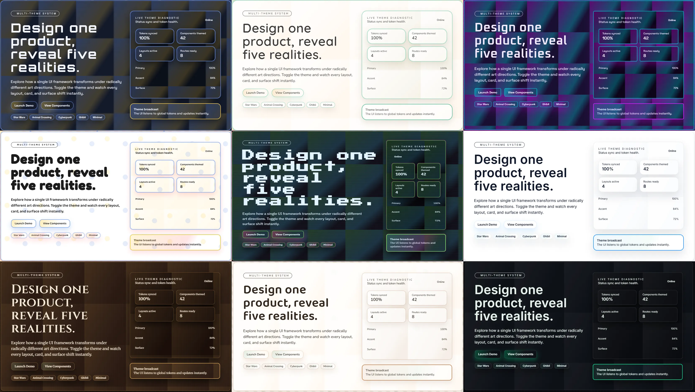

# Theme Capsule

一個多主題的 React + TypeScript + Vite 展示站，支援即時切換主題、可複製的模板庫，以及多個主題化頁面（Home / Admin / Dashboard / Blog）。

英文版： [README.md](README.md)

<p align="center">
  
</p>

## 為什麼會有 Theme Capsule？

很多時候，我們做得出功能，卻很難一開始就把 UI 做得「有感覺」。

尤其對不是設計背景的工程師來說，美化 UI 往往是：
- 最後才做  
- 最花時間  
- 最容易妥協成「乾淨但普通」

但在嘗試 **vibe coding** 的過程中，我意外發現一件事：

> **只要一開始就給 AI 一個「風格非常強烈的主題」，  
> 整個 UI 的完成度會瞬間拉高。**

星際大戰、動物森友會、吉卜力、復古電玩、NASA 控制室——  
當風格夠明確，顏色、字體、間距、動畫、元件形狀都會自然「站到對的位置」。

問題是：  
👉 **這些風格幾乎沒有現成、可直接用在前端專案的參考模板。**

於是我做了 **Theme Capsule**。

---

## Theme Capsule 是什麼？

Theme Capsule 不是一個 UI Framework，  
也不是一套設計系統。

它比較像是一個 **「風格展示艙」**：

- 每一顆 Capsule = 一種強烈、可感知的 UI 風格  
- 同一個功能頁面（Home / Admin / Dashboard / Blog），在不同主題下會呈現完全不同的氣氛  
- 所有風格都被拆解成 **可理解、可複製的設計 token 與元件寫法**

你可以把它當成：

- 想不到 UI 方向時的 **靈感來源**
- 跟 AI 溝通設計時的 **風格參考座標**
- 快速做出「不像預設模板」產品的 **起跑線**

---

## 這個專案適合誰？

如果你符合下面任何一點，Theme Capsule 可能會對你有幫助：

- 不想再做「看起來像預設後台」的專案
- 想用 AI 協助設計，但不知道該怎麼描述風格
- 想快速比較「同一套功能，在不同視覺語言下的差異」
- 想做 side project、demo、內部工具，但希望第一眼就有記憶點
- 對設計有興趣，但不想從 Figma / Design System 開始

---

## 你可以怎麼用它？

- **直接切主題看效果**  
  看哪一種風格最符合你現在的產品或想法

- **複製模板到你的專案**  
  Card、Table、Dashboard、Blog 版型都已經主題化

- **拿風格描述去問 AI**  
  每個主題都有清楚的「風格語言」，非常適合當 prompt

- **當作風格實驗場**  
  同一個功能，在不同世界觀下會變成什麼樣子？

---

## 我希望它帶來什麼？

Theme Capsule 的目標不是「教你怎麼設計」，  
而是讓你更容易做到一件事：

> **做出「不像你平常會做出來的 UI」。**

如果它能幫你更快找到風格方向、  
或讓你第一次覺得「欸，我做的介面好像有點不一樣」，  
那這個專案就達到目的了。

---

## 內含哪些？
- 12 種強烈風格主題（星戰、動森、電馭、吉卜力、極簡、樂高、復古電玩、Apple Vision、NASA 控制、奇幻 RPG、咖啡館、Linear、Supabase、Grafana）。
- 全域 ThemeSwitcher：token 控制色彩、字體、圓角、陰影、紋理、動畫。
- 模板庫：每主題可複製程式碼與即時預覽，含中英風格說明（導覽/側欄、Hero/Card/Form/Table、圖表、徽章、空狀態、步驟、CTA、Stats）。
- 主題化頁面：首頁行銷、Admin、Dashboard（假數據長條+折線/tooltip）、Blog 清單/詳情（頭像、TOC、導覽）、一致導覽列。
- `sample_style.md` 風格要點已映射到模板頁「風格說明」。

## 開發與執行
```bash
npm install
npm run dev    # 本地開發
npm run build  # 型別檢查 + 正式建置
npm run preview
```

## 專案結構
- `src/index.css` + `src/themes/styles/*.css`：基礎 tokens 與各主題延伸 CSS 變數/背景。
- `src/themes/*.json`：主題 token；於 `src/core/theme-loader/themeRegistry.ts` 註冊。
- `src/core/theme-store`：套用 tokens 至 `:root` 並記憶選擇。
- Layout/Pages：`src/layouts/*`、`src/pages/home`、`src/pages/admin`、`src/pages/dashboard`、`src/pages/blog`、`src/pages/templates`。
- Blog 資料：`src/pages/blog/blogData.ts`（佔位頭像 SVG）。
- 模板庫：`src/pages/templates/templateLibrary.ts`（主題模板 + 風格說明）、`TemplatePage.tsx`。

## 新增/調整主題
1) 在 `src/themes/` 建立 `<name>.json` 定義主色/文字等 tokens。  
2) 在 `src/themes/styles/` 建立 `<name>.css` 補充背景、紋理、按鈕/卡片/表單等變數。  
3) 在 `src/core/theme-loader/themeRegistry.ts` 註冊。  
4) （可選）在 `templateLibrary.ts` 補上該主題的風格說明。  

## 提醒
- Template 頁的 EN/中文切換只影響說明文字，程式碼片段保持英文。  
- 圖表資料為假數據，目的是突出各主題視覺差異。  

## 授權
MIT（詳見套件描述）。
